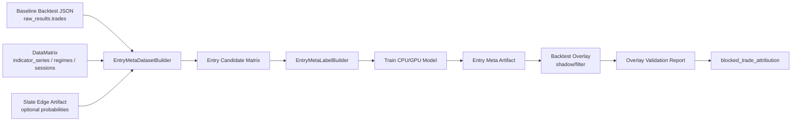

# Entry Meta-Label Overlay Lab 设计规格

日期：2026-05-03  
范围：Research + Backtest overlay；不接入 demo/live runtime；不影响真实下单。

## 1. 背景与根因

当前 State Edge / GPU Research Lab 已经能完成：

- 训练 `long_edge_prob / short_edge_prob / no_trade_prob` 市场状态概率 artifact。
- 在 backtest overlay 中执行 `shadow` 与 `filter`。
- 输出 `blocked_entry_events` 与 `blocked_trade_attribution`，可审查每条被挡入场。

H1 `2026-01-01` 到 `2026-04-15` 的 long-only `filter@0.50` 结果说明：工程链路可用，但模型目标不对。19 条被挡事件里，8 条能精确匹配 baseline 成交，合计 PnL `+140.29`，其中 2 笔大赢家贡献明显。现有模型是在预测“市场状态是否偏 long/short”，但实际使用场景是“已有策略在此刻入场是否值得保留”。这两个目标不等价。

下一阶段目标不是继续调 State Edge 阈值，而是新增 Entry Meta-Label Overlay Lab：以真实策略入场为样本，训练 `take_entry_prob / block_entry_prob`，让模型直接服务于“是否放行这笔入场”。

## 2. 目标与非目标

目标：

- 构建 trade-aware entry candidate 数据集，样本单位是“某策略在某 bar 产生并成交的入场”。
- 训练逐 TF 独立的 entry meta-label 模型，输出 `take_entry_prob / block_entry_prob`。
- 复用现有 State Edge 特征、K 线序列特征、regime/session/strategy 上下文，但模型目标改为交易结果。
- 在 backtest overlay 中以 `shadow` 与 `filter` 评估，不进入 demo/live。
- 报告必须包含 blocked-trade attribution，证明是否挡掉大盈利单。

非目标：

- 不替代现有策略，不生成新策略信号。
- 不接入真实下单、demo runtime、live runtime。
- 不把所有 signal evaluation 都当训练样本；第一阶段只使用 baseline 中真实形成成交的 entry trade。
- 不用兼容分支长期保留双轨语义；State Edge 市场状态模型与 Entry Meta-Label 模型职责分开。

## 3. 推荐方案与取舍

### 推荐：Entry Trade Meta-Label

使用 baseline backtest 的 `raw_results.trades` 作为训练样本。每条样本绑定：

- `entry_time`
- `strategy`
- `direction`
- `regime`
- `confidence`
- `entry_price`
- entry 当时可见的 indicator / FeatureHub / session / hard-soft regime 特征
- 可选 K 线序列窗口
- 可选 State Edge 三分类概率作为输入特征

标签由 baseline trade 后续结果生成：

- `take_entry = 1`：该 entry 是值得保留的交易。
- `take_entry = 0`：该 entry 是应阻断的交易。

默认标签规则：

- `take_entry = 1` 当 `pnl > 0`。
- `take_entry = 0` 当 `pnl <= 0`。

样本权重用于保护大赢家：

- 正收益权重随 `pnl` 或 `pnl_pct` 增加。
- 大亏损也提高权重，但不得让模型通过牺牲少数大赢家换取小亏损过滤。
- 报告必须单独列出 blocked matched baseline trades 的 PnL 分布。

取舍：第一阶段只覆盖实际成交 entry，样本数比所有信号候选少，但标签真实、合同清楚、能直接解释交易增量。

### 备选：Signal Evaluation Meta-Label

使用 `signal_evaluations` 作为样本，覆盖更多未成交信号。优点是样本更多，缺点是它不等于真实可成交 entry，受过滤器、仓位、pending entry、执行规则影响，容易再次训练出与交易结果错位的模型。

结论：不作为第一阶段。

### 备选：继续调 State Edge 阈值

只调整 `long_edge_prob` / `short_edge_prob` 阈值。优点是无需新增数据集，缺点是已经被 H1 attribution 证明会挡掉大盈利单，继续调阈值无法解决“目标函数错位”。

结论：停止作为主线，只保留为输入特征或对照组。

## 4. 模块职责

新增目录建议：`src/research/entry_meta/`

| 模块 | 职责 | 不做 |
|---|---|---|
| `dataset.py` | 从 baseline backtest JSON + DataMatrix 构建 entry candidate 数据集 | 不运行回测，不修改策略 |
| `labels.py` | 根据 trade outcome 生成 `take_entry` 标签与样本权重 | 不读取未来特征，只读取已完成 trade outcome 作为离线标签 |
| `features.py` | 构造 entry 时刻可见特征 manifest | 不允许 future/forward/barrier/outcome 字段进入模型特征 |
| `training.py` | 训练 CPU/GPU entry meta-label 模型并输出 artifact | 不接入 runtime |
| `artifacts.py` | 定义 artifact schema 与序列化/反序列化 | 不保存不可审查的任意对象 |
| `overlay.py` | Backtest only overlay：按 `take_entry_prob` shadow/filter 入场 | 不探测 engine/portfolio 私有字段 |
| `evaluation.py` | 生成 overlay 验收报告与 blocked attribution | 不用单一 accuracy 作为验收结论 |
| `quality.py` | 训练后质量门禁 | 不替代最终 backtest overlay 验收 |

Backtest 侧只新增正式端口或复用现有端口：

- 输入：entry meta artifact。
- 输出：`entry_meta_overlay` 报告、`blocked_entry_events`、`blocked_trade_attribution`。
- 约束：不接入 demo/live runtime。

## 5. 数据流

训练时的 label 可以使用 trade outcome，因为这是离线监督目标。特征必须只来自 entry 时刻当前/历史可见字段。

## 6. Artifact 合同

`entry_meta_artifact.json` 至少包含：

- `model_id`
- `symbol`
- `timeframe`
- `backend`
- `model_kind`
- `feature_manifest`
- `label_summary`
- `sample_weight_summary`
- `train_window`
- `oos_window`
- `metrics`
- `probability_distribution`
- `top_bucket_report`
- `predictions`

每条 prediction：

- `bar_time`
- `strategy`
- `direction`
- `take_entry_prob`
- `block_entry_prob`
- `threshold_context`

约束：

- predictions 以 `bar_time + strategy + direction` 为 key。
- artifact 不保存 sklearn/torch 原始不可审查对象；保存可反序列化的模型 payload 或受控权重结构。
- `feature_manifest` 必须通过 leak guard。

## 7. Overlay 与验收

Overlay 模式：

- `shadow`：只记录 `take_entry_prob`，不改变交易。
- `filter`：仅在 backtest 中，当对应入场的 `take_entry_prob < threshold` 时阻断。

验收指标：

- 主指标：PnL、expectancy、PF、max DD、trade count。
- 必须满足：PnL、PF、expectancy 不退化，max DD 不比 baseline 恶化超过 10%。
- 至少一个交易增量指标改善，才可标记 `accepted`。
- 如果 blocked attribution 显示挡掉大盈利单导致净 PnL 下降，直接 `rejected`。
- 不要求所有 TF 通过；逐 TF 独立验收。

报告必须包含：

- shadow check。
- threshold grid decision。
- blocked entry count by strategy/regime/direction。
- exact blocked events。
- matched baseline trades：matched count、unmatched count、matched PnL、wins/losses、by strategy、by exit reason。
- top blocked winners：列出被挡的最大盈利单。

## 8. GPU 与 CPU 职责

CPU：

- Logistic regression / random forest / gradient boosting baseline。
- 快速验证标签、特征、样本权重是否有效。
- 作为可解释对照组。

GPU：

- K 线序列窗口模型，如 `sequence_mlp`。
- 后续可扩展轻量 Transformer/TCN，但必须先证明比 CPU baseline 有交易增量。
- `--backend gpu` 必须沿用 fail-fast，不得静默回退 CPU。

GPU 的意义不是“替代 CPU”，而是用于更适合并行矩阵计算的序列形态表达学习；CPU 负责低成本基线和可解释对照。

## 9. 风险与防护

风险一：样本太少。

- 防护：逐 TF 独立 quality gate；最低样本数不够直接 `refit`。

风险二：模型只学到策略身份偏差。

- 防护：报告按 strategy 分组；若模型只过滤某几个策略而无跨期收益证据，不得 accepted。

风险三：挡掉大盈利单。

- 防护：样本权重保护大赢家；报告必须列出 top blocked winners；挡掉大赢家导致净收益退化时 rejected。

风险四：特征泄漏。

- 防护：复用 State Edge leak guard；禁止 `forward/future/barrier/outcome/label/pnl/exit` 字段进入特征。

风险五：和 State Edge 职责混淆。

- 防护：State Edge 继续是市场状态概率；Entry Meta 是交易入场保留概率。State Edge 概率只能作为 Entry Meta 的输入特征或对照，不再直接作为主过滤器推广。

## 10. 测试计划

单元测试：

- label builder：盈利、亏损、零收益、大赢家权重、大亏损权重。
- feature manifest：禁止未来字段、交易 outcome 字段、barrier outcome 字段。
- dataset builder：baseline trades 与 DataMatrix entry time 对齐。
- artifact roundtrip：序列化/反序列化稳定。
- backend：CPU 可用；GPU 缺依赖 fail-fast。
- overlay：shadow 不改变交易；filter 只通过正式 overlay 端口阻断。

集成测试：

- H1 小窗口：baseline JSON → dataset → train → artifact → shadow/filter。
- blocked attribution：被挡事件能与 baseline trade 精确 join。
- threshold report：PF 微升但 PnL/expectancy 下降必须 rejected。

## 11. 第一阶段交付边界

第一阶段只交付：

- `src/research/entry_meta/` 离线研究模块。
- Research CLI：`python -m src.ops.cli.entry_meta_lab ...`
- Backtest overlay 参数：`--entry-meta-artifact`、`--entry-meta-mode shadow|filter`、`--entry-meta-threshold-grid`。
- 报告 CLI：`entry_meta_overlay_report`。
- H1 小窗口 smoke 与一份 H1 长窗口 attribution 报告。

第一阶段不交付：

- demo/live runtime 接入。
- 自动部署。
- 多账户实时概率服务。
- 前端 UI。

## 12. 成功标准

一个 TF 的 Entry Meta Overlay 可进入下一阶段，当且仅当：

- shadow 完全不改变 baseline。
- filter 在至少一个阈值上同时满足 PnL、PF、expectancy 不退化。
- max DD 未恶化超过 10%。
- blocked attribution 不显示“用多个小亏损过滤换掉少数大盈利单”的负向结构。
- OOS 或分段复测不只在单一区间成立。

如果 H1 仍失败，则停止扩展 TF，回到标签和样本权重设计，而不是继续消耗 GPU 跑更大的模型。
