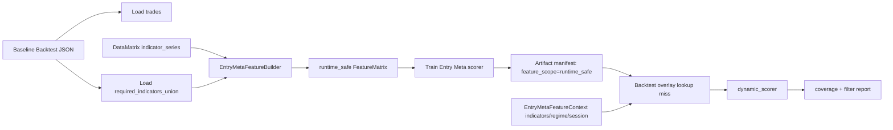

# Entry Meta Runtime-Safe Feature Contract 设计规格

日期：2026-05-03  
范围：Research + Backtest overlay；不接入 demo/live runtime；不影响真实下单。

## 1. 背景与证据

Entry Meta 动态打分已经具备 lookup miss 后调用 JSON-native scorer 的能力，并且
backtest session context 已与策略 session filter 解耦。最新验证说明 session 问题已经收口：

- H1 `2026-01-01` 到 `2026-04-15` 重新训练 Entry Meta artifact：`accepted`
  - 样本 `53`，标签 `take_entry=25 / block_entry=28`
  - OOS `16`
  - session category mapping 覆盖 `asia/london/new_york/off_hours`
- 短窗口 `2026-03-01` 到 `2026-03-15` shadow 与 baseline 完全一致。
- forward 窗口 `2026-04-15` 到 `2026-04-30` shadow 与 baseline 完全一致，但：
  - `observed=5`
  - `dynamic_scored=0`
  - `missing_predictions=5`
  - `missing_by_reason={"entry_meta_feature_missing": 5}`

进一步检查 artifact 的 `feature_keys`：共有 `167` 个特征，其中包含
`temporal`、`microstructure`、`regime_transition`、`session_event`、`candle_patterns`
等 FeatureHub provider 输出。Backtest 动态 scorer 的 `EntryMetaFeatureContext` 当前只持有
signal bar 当下的 `indicators` snapshot、regime、session、entry 信息，因此无法重建这些离线
provider 特征。根因是训练特征合同与动态评分上下文不一致。

## 2. 目标与非目标

目标：

- 为 Entry Meta 明确区分两种 feature scope：
  - `runtime_safe`：训练和 backtest 动态 scorer 都能重建的特征。
  - `research_full`：离线研究全量特征，只能用于 artifact prediction lookup 或离线分析。
- Entry Meta Lab 默认产出 `runtime_safe` artifact，让未来窗口可以走 `dynamic_scorer`。
- artifact manifest 明确写入 `feature_scope`、runtime-safe 指标白名单、动态评分是否支持。
- Backtest overlay 只对 `runtime_safe` artifact 尝试 dynamic scorer；非 runtime-safe artifact lookup miss 时明确记录 unsupported reason 并放行。
- 保持第一阶段只在 Research + Backtest overlay 内验收，不接入 demo/live。

非目标：

- 不把 FeatureHub provider 直接接入 backtest runtime。
- 不在 overlay 中从 engine、portfolio 或私有字段探测历史 bars。
- 不为 full research artifact 做临时兼容补丁。
- 不把 GPU 用到小样本 tabular baseline；GPU 后续仍用于 K 线序列/形态模型。
- 不在本阶段解决 pending-entry fill time / fill price 重新评分。

## 3. 设计决策

### 3.1 Feature Scope

新增 Entry Meta feature scope：

| scope | 用途 | 动态 scorer |
|---|---|---|
| `runtime_safe` | 默认训练路径；服务 backtest forward/shadow/filter | 支持 |
| `research_full` | 离线探索 FeatureHub 全量特征能力 | 不支持 lookup miss 后动态打分 |

`runtime_safe` 只允许以下特征进入 artifact：

- `entry.confidence`
- `entry.direction.buy`
- `entry.direction.sell`
- `entry.price`
- `entry.strategy_code`
- baseline backtest capability plan 中 `required_indicators_union` 对应的当前指标字段
- `matrix.regime_code`
- `matrix.session_code`

不允许进入 `runtime_safe` 的特征：

- FeatureHub provider 输出，例如 `indicator.temporal.*`、`indicator.microstructure.*`、
  `indicator.regime_transition.*`、`indicator.session_event.*`、`indicator.candle_patterns.*`
- 当前 backtest decision context 无法稳定提供的 DataMatrix 指标
- 所有现有 leak guard 禁止字段：`forward/future/barrier/outcome/label/pnl/exit`

### 3.2 Runtime Indicator Allowlist

Entry Meta Lab 应从 baseline backtest JSON 中读取当前回测策略能力计划：

```text
raw_results[0].strategy_capability_execution_plan.required_indicators_union
```

该列表是训练时和 backtest 动态评分之间的正式桥接合同。`runtime_safe` builder 只保留
`matrix.indicator_series[(indicator, field)]` 中 `indicator` 位于该 allowlist 的字段。

如果 baseline JSON 缺少 capability plan：

- `runtime_safe` 模式必须 fail-fast，提示 baseline 缺少 `required_indicators_union`。
- 不自动回退 `research_full`，避免训练出不能动态打分的 artifact。

### 3.3 Artifact Manifest

`EntryMetaArtifact.feature_manifest` 新增字段：

```json
{
  "source": "entry_meta",
  "feature_scope": "runtime_safe",
  "dynamic_scoring_supported": true,
  "runtime_indicator_names": ["adx14", "atr14", "bar_stats20"],
  "forbidden_tokens": ["forward", "future", "barrier", "outcome", "label", "pnl", "exit"],
  "n_features": 42,
  "category_mappings": {
    "strategy": {},
    "regime": {},
    "session": {}
  }
}
```

`research_full` artifact 必须写：

```json
{
  "feature_scope": "research_full",
  "dynamic_scoring_supported": false
}
```

旧 artifact 未声明 `feature_scope` 时按 `research_full` 处理，lookup prediction 仍可用，但 lookup miss
不得继续尝试 dynamic scorer。

### 3.4 Overlay Gate

`EntryMetaBacktestOverlay` 初始化时读取 manifest：

- `dynamic_scoring_supported=true` 且 `feature_scope=runtime_safe` 时，构造
  `EntryMetaFeatureRowBuilder` 和 `EntryMetaScorer`。
- 否则不构造 dynamic scorer。

lookup miss 后：

1. `runtime_safe` artifact：尝试 dynamic scorer。
2. `research_full` 或旧 artifact：放行并记录 `entry_meta_dynamic_feature_scope_unsupported`。
3. 动态特征缺失：继续记录 `entry_meta_feature_missing`。
4. 未知 strategy/regime/session：继续记录 `entry_meta_unknown_category`。

该 gate 的目标不是挡单，而是让报告准确暴露“模型为什么没有实时打分”。

## 4. 模块职责

修改范围：

| 模块 | 职责变化 |
|---|---|
| `src/research/entry_meta/features.py` | 支持 `feature_scope` 与 runtime indicator allowlist；manifest 写入 scope |
| `src/research/entry_meta/lab.py` | 从 baseline JSON 读取 trades 与 capability plan，默认传入 runtime-safe allowlist |
| `src/research/entry_meta/overlay.py` | 根据 manifest gate dynamic scorer；unsupported scope 明确报告 |
| `src/ops/cli/entry_meta_lab.py` | 暴露 `--feature-scope runtime_safe|research_full`，默认 `runtime_safe` |
| `src/research/core/config.py` | 读取 `[entry_meta_model] feature_scope` |
| `config/research.ini` | 新增 `feature_scope = runtime_safe` |
| `docs/codebase-review.md` | 记录 Entry Meta 动态打分的特征合同边界 |
| `tests/research/entry_meta/` | 覆盖 runtime-safe feature filtering、artifact manifest、overlay scope gate |

不修改：

- `src/trading/`
- `src/risk/`
- `src/api/`
- demo/live runtime factories

## 5. 数据流



## 6. 失败边界

必须失败：

- `runtime_safe` 模式下 baseline JSON 缺少 `required_indicators_union`。
- artifact 声明 `dynamic_scoring_supported=true` 但 `feature_scope` 不是 `runtime_safe`。
- artifact `feature_keys` 与 model payload `feature_order` 不一致。
- runtime-safe builder 生成的特征数为 0 或只有 entry/category 而无任何指标特征时，quality gate 应标记
  `refit` 或训练阶段 fail-fast，避免假 accepted。

可降级放行：

- lookup miss 且 artifact scope 不支持 dynamic scorer。
- 当前 entry 缺少 artifact 要求的 runtime-safe indicator field。
- 当前 entry 的 strategy/regime/session 未出现在训练 category mapping。

所有可降级情况必须进入 `missing_by_reason`，不得静默吞掉。

## 7. 测试策略

单元测试：

- `EntryMetaFeatureBuilder(feature_scope="runtime_safe")` 只保留 allowlist 中的 indicator keys。
- runtime-safe builder 排除 `temporal/microstructure/regime_transition/session_event/candle_patterns` provider keys。
- baseline 缺少 `required_indicators_union` 时 Entry Meta Lab fail-fast。
- artifact roundtrip 保留 `feature_scope` 与 `dynamic_scoring_supported`。
- overlay 对 `research_full` artifact lookup miss 返回
  `entry_meta_dynamic_feature_scope_unsupported`，并放行。
- overlay 对 `runtime_safe` artifact lookup miss 仍尝试 dynamic scorer。

集成或 smoke 测试：

- 使用 H1 accepted runtime-safe artifact 跑 forward shadow，报告中 `dynamic_scored > 0`。
- shadow 不改变 baseline trade count / PnL / PF / expectancy / DD。
- filter 仍只在 backtest overlay 中阻断，不接入 runtime。

## 8. 验收标准

工程验收：

- 新训练的 Entry Meta artifact manifest 标明 `feature_scope=runtime_safe`。
- forward shadow 中 `score_source_counts.dynamic_scorer > 0`。
- `missing_by_reason.entry_meta_feature_missing` 不再由 FeatureHub provider 特征造成。
- `research_full` artifact 不再在 lookup miss 时误报为 feature missing，而是明确 scope unsupported。

交易验收：

- 先通过 shadow 不改变 baseline。
- 再跑 threshold grid filter。
- filter 必须满足：PnL、PF、expectancy 不退化，max DD 不比 baseline 恶化超过 10%。
- blocked attribution 不得显示挡掉关键大盈利单。
- 如果 runtime-safe artifact 只提高 coverage 但交易指标不增益，结论应是 `rejected/refit`，不是继续推向 runtime。

## 9. GPU 位置

本阶段仍使用 CPU tabular baseline。原因是样本数小、模型是逻辑回归/表格特征，GPU 不会带来有效增益。

GPU 的下一条合理路线仍是 K 线序列/形态模型：

- 输入固定窗口 OHLC/indicator sequence。
- 训练 sequence MLP/TCN/轻量 Transformer。
- 只有当 runtime-safe tabular baseline 的特征合同跑通后，再比较 GPU 序列模型是否带来交易增量。

因此本 spec 不新增 GPU 工作，只清理 Entry Meta 动态 scorer 的可执行前提。
