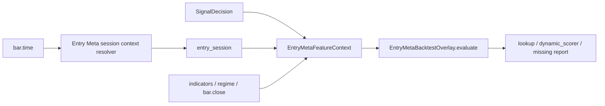

# Entry Meta Session Context 覆盖率优化设计规格

日期：2026-05-03  
范围：Research + Backtest overlay；不接入 demo/live runtime；不影响真实下单。

## 1. 背景与问题

Entry Meta 动态打分已经能在 backtest overlay 中对 artifact 未预计算的 entry 做
`take_entry_prob / block_entry_prob` 推理。该能力依赖 `EntryMetaFeatureContext`，其中
`session` 是训练与回测必须同构的类别特征。

当前回测 runner 的 session 来源有隐性限制：只有配置了 `strategy_sessions` 时才初始化
`SessionFilter`，否则传给 Entry Meta 的 `entry_session` 默认为 `"unknown"`。这会导致两个问题：

- 如果 artifact 的 session category mapping 不包含 `"unknown"`，动态打分会失败并放行。
- overlay 报告里的 `entry_meta_unknown_category` 会混入本可由 bar time 正常推导的样本，降低模型覆盖率。

根因不是模型能力，而是回测上下文把“是否启用策略 session 过滤”和“是否能识别当前市场 session”耦合在一起。二者职责不同。

## 2. 目标与非目标

目标：

- 在 backtest 中为 Entry Meta 动态打分提供稳定的 session context。
- 不再依赖 `strategy_sessions` 是否配置来决定能否解析 session。
- 使用公开 session 解析能力从 `bar.time` 推导 `asia/london/new_york/off_hours`。
- 保留 `"unknown"` 作为异常兜底，但让它只代表时间无法解析或解析失败。
- 用测试证明未配置 strategy session 限制时，Entry Meta 仍能拿到确定 session。

非目标：

- 不修改 demo/live runtime。
- 不改变策略 session 过滤规则。
- 不改变 Entry Meta artifact category mapping 合同。
- 不为旧 artifact 增加兼容类别别名。
- 不在本阶段做 pending-entry fill time / fill price 重新评分。

## 3. 设计决策

### 3.1 拆分两个职责

回测里存在两个不同职责：

| 职责 | 现状 | 本次设计 |
|---|---|---|
| 策略 session 过滤 | 仅当 `strategy_sessions` 非空时启用 | 保持不变 |
| Entry Meta session context | 间接复用策略 session filter | 独立从 `bar.time` 解析 |

Entry Meta 的 `session` 是特征上下文，不是过滤条件。它应该始终尽力解析，即使当前没有启用任何策略 session 白名单。

### 3.2 BacktestEngine 拥有独立 context session resolver

在 `BacktestEngine` 初始化阶段建立一个独立的 Entry Meta session context provider。推荐复用现有公开类型
`SessionFilter`，但不把它绑定到策略白名单：

```text
BacktestEngine
  _session_filter                  -> strategy_sessions 过滤与策略准入上下文
  _entry_meta_session_context       -> Entry Meta feature context 解析
```

`_entry_meta_session_context` 只负责调用 `current_sessions(bar.time)`，并把第一项 session 传给
`process_decision(..., entry_session=...)`。它不参与策略过滤，不阻断交易。

### 3.3 失败边界

必须失败：

- `SessionFilter` 自身配置非法时仍按现有规则失败。

可降级：

- `bar.time` 缺失、类型非法或 session 解析异常时，`entry_session="unknown"`。
- 降级只影响 Entry Meta 动态打分覆盖率，不阻断交易。

降级不应静默掩盖：overlay 原有 `missing_by_reason` / `dynamic_score_failures` 会继续暴露未知类别或特征构造失败。

## 4. 数据流



## 5. 模块职责

修改范围：

| 模块 | 职责变化 |
|---|---|
| `src/backtesting/engine/runner.py` | 独立解析 Entry Meta session context，不再依赖 `_session_filter` 是否存在 |
| `tests/backtesting/` | 增加未配置 `strategy_sessions` 时仍能解析 session 的覆盖 |
| `docs/codebase-review.md` | 记录本次边界收口与仍未解决的 fill-time 评分限制 |

不修改：

- `src/trading/`
- `src/risk/`
- `src/api/`
- demo/live runtime factories
- Entry Meta artifact schema

## 6. 测试策略

单元或窄集成测试：

- 未配置 `strategy_sessions` 时，回测 Entry Meta context session 不应为 `"unknown"`。
- 已配置 `strategy_sessions` 时，策略过滤行为不变。
- 如果 session resolver 返回空列表，仍降级为 `"unknown"`。

回归测试：

- Entry Meta overlay 与 scoring 聚焦测试继续通过。
- State Edge overlay 回归测试不受影响。
- `backtest_runner --help` 继续暴露 Entry Meta 参数。

## 7. 成功标准

工程成功：

- Entry Meta 动态 scorer 的 session 上下文与训练 DataMatrix session 语义对齐。
- 未启用策略 session 过滤时，动态 scorer 不再因为默认 `"unknown"` 失去覆盖。
- 改动只存在于 Research + Backtest overlay，不污染真实交易主链。

交易研究成功仍以后续报告为准：

- `dynamic_scored / observed` 覆盖率提高。
- `entry_meta_unknown_category` 中由 session 引发的失败显著减少。
- shadow 仍不改变 baseline。
- filter 是否有价值继续按 PnL、PF、expectancy、DD 和 blocked attribution 判定。

## 8. 保留问题

pending-entry 仍在 signal bar/time/close 上评分，而不是在后续真实 fill time / fill price 上重新评分。该问题会影响挂单类策略的真实交易贴合度，但它会改变入场评价时点和执行语义，应作为下一阶段独立设计，不并入本次 session context 覆盖率修正。
